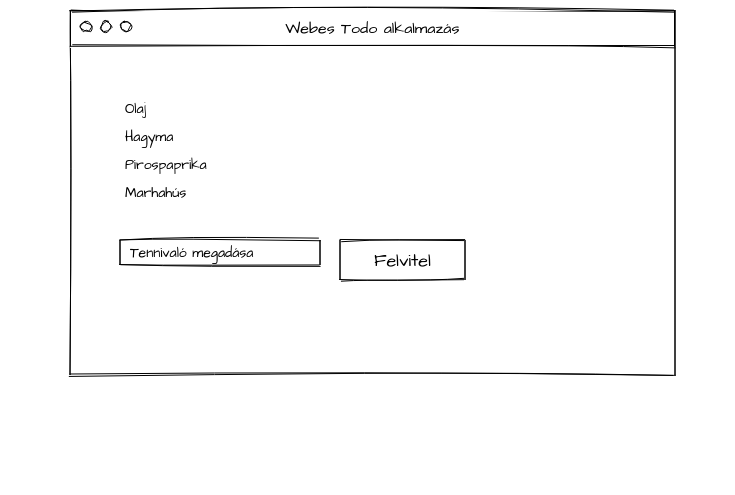

# Webes TODO alkalmazás készítése
- Markdown állomány fogalma [github markdown doksi](https://guides.github.com/features/mastering-markdown/)
- a webes fejlesztés fogalma
  - html állományok előállítása és eljuttatása a felhasználó (Internet) böngészőjébe, ami megjeleníti és a felhasználó számára választási lehetőségeket ad.
  - amikor a html állományt előállító gép és a böngészőt futtató gép nem ugyanaz, akkor kell valami, ami az egyikről segít a másik gépet elérni. Ez a http protokoll [wikipédia link](https://hu.wikipedia.org/wiki/HTTP)
    - Négy eszköz: kérés, tartalom, fejléc, végállapot
- MVC alkalmazásfejlesztés: Model-View-Controller
  - a fejlesztőkörnyezetünk három fontos szereplőt azonosít és különböztet meg.
  - vezérlő (Controller): Minden kérés hozzá érkezik, a feladata a kérés kiszolgálása, vagy a kiszolgáláshoz szükséges feladatok delegálása, majd a feladatok elvégzésével a végeredmény továbbítása a kérő felé. 
  - adatok (Model) adatok köre, létrehozása, kiszámolása, előállítása, transzformációja, a kész adatok szolgáltatása a másik két szereplőnek
  - megjelenítés (View) a feladata a kinézethez szükséges elemek meghatározása, létrehozása, előállítása, módosítása
- ASP.NET MVC: névkonvenció alapú, a könyvtárak nevei és az állományok nevei egy elpőre meghatározott konvenciót követnek, a működésük ebből következik.
- Egy megjelenítőoldal készítése
- követelmények meghatározása (specifikáció)
- A Model bevezetése
  - szükségünk van egy felsorolásra, amit a programunk valahol előállít (változó)
  - az adatokat "el kell juttatni" a nézetre
  - majd az adatokat a nézetünk megfelelő helyén meg kell jeleníteni.

## Alkalmazás futtatása
### IIS (Internet Information Server)
- ha élesben akarjuk az alkalmazásunkat futtatni, akkor a szervergépre telepíteni kell.
- a fejlesztő gépre a Visual Studio telepítése automatikusan telepít egy IIS Express nevű alkalmazást, ami az IIS fejlesztési célokra átalakított/lebutított egy felhasználós változata.

## Egy HTTP kérés kiszolgálása (adatok szolgáltatása a felhasználó felé)

```

                                              +-------------------------------------------------+
   +-------------------+                      |  IIS (TodoApp)                                  |
   | Böngésző          |                      |-------------------------------------------------|
   |-------------------|                      |                                                 |
   |                   |   HTTP GET           |  Alkalmazás címe:http://localhost:52409/        |
   |                   | +------------------> |                                                 |
   |                   |                      |  A kérés az alkalmazáson belül: /Home/Index     |
   |                   |   HTML állomány      |                                                 |
   |                   |<--------------------+|                                                 |
   |                   |                     ||   Az alkalmazáson belüli /Home jelenti az       |
   |                   |                     ||   Home vezérlőt (HomeController)                |
   |                   |                     ||                                                 |
   |                   |                     ||   A második Index jelenti a vezérlő megfelelő   |
   +-------------------+                     ||   függvényének a nevét                          |
                                             ||                                                 |
                                             ||   A munkavégző függvény megnevezése: Action     |
                                             ||                                                 |
                                             ||   Az Action a munka elvégzője, létrehozza az    |
                                             ||   adatokat, megkeresi a megfelelő nézetet (View)|
                                             ||   és az adatokat és a végrehajtást átadja ennek |
                                             ||   a nézetnek                                    |
                                             ||                                                 |
                                             ||   A nézet az adatok segítségével generálja a    |
                                             +|   HTML állományt, amit visszaküld a böngészőnek |
                                              |   A nézet állománya cshtml, ami egy keveréke    |
                                              |   a c# és a html nyelvnek, és a neve: RAZOR     |
                                              +-------------------------------------------------+ 
```

Ez a kódban a következő utat járja be:

```


         Kérés      +--------------------------------------+                   +------------------+
       +----------> |  Controller                          |                   |  View            |
                  + |--------------------------------------|  +----------+     |------------------|
                  | |                                      |  |Model     |     |                  |
    +-----------+ | |  +-------------------+               |  |----------|     |                  |
    |Útválasztás| +--->| Action            |               |  |          |     |                  |
    +-----------+   |  |-------------------|               |  +----------+     |                  |
                    |  |                   | +-------------------------------> |                  |
                    |  |                   |               |                   |                  |
                    |  +-------------------+               |                   |                  |
                    |                                      |                   |                  |
                    |                                      |                   |                  |
                    |                                      |                   |                  |
                    |                                      |                   |                  |
                    |                                      |                   |                  |
                    +--------------------------------------+                   +------------------+


```

## Adatok szállítása a felhasználótól az alkalmazásig

- Az adatok szállítására a felhasználótól az alkalmazásunkig a kérésben van lehetőségünk
- A vizsgálathoz létrehozzuk a világ legegyszerűbb űrlapját



A feladat pedig, hogy hozzunk létre egy beviteli mezőt és egy gombot, amivel egy feladatot fel tudunk küldeni a szerverre

## Querystring-gel
Ha egyszerűen egy html űrlapot készítünk, és a form tag-nek nem adunk meg paramétereket és az űrlapon vannak:
- input mezők
- és egy gomb

```
<form>
    <input type="text" name="Megnevezes" value="" />
    <input name="Elvegezve" />
    <button>Felvitel</button>
</form>
```

Akkor a gomb megnyomásakor a böngésző az url mögé un. QueryString paramétereket "ragaszt" és így küldi a következő kérését a szerver felé GET kéréssel.

### Problémák:
- ugyanarra az action-re megy a kérés, mint az előző, ezt meg tudjuk oldani a *form* tag **action** paraméterével:

```
  <form action="/Home/Add">
    ...
  </form>
```

- webes konvenció, hogy a GET típusú kérés nem változtat adatot a szerveren, me tudom oldani a *form* tag **method** paraméterével:

```
  <form action="/Home/Add" method="post">
    ...
  </form>
```

- Új Probléma: Post esetén az adatok NEM QueryString-ként mennek a szerver felé, hanem Form Data formában. Ezt megoldja az ASP.NET MVC: az Action-nél megadhatjuk a paramétert, amibe automatikusan bekerül a böngészőből érkező adat.

- a bevitt adatok nem őrződnek meg a szerveren két kérés között, (nincs un. perzisztens adatunk)


## Alkalmazás váz
- A listaoldalon a következő lehetőségek elérhetőek
  - új elem felvitele
  - meglévő elem módosítása
  - meglévő elem törlése
  - meglévő elem elvégzésének a jelzése

- Az egyes lehetőségek linkek segítségével elérhetőek
- Ha egy-egy linkra kattintunk, akkor az adott feladattal kapcsolatos képernyőre/oldalra kerülünk

### Adatbevitel az ASP.NET MVC-ben
- Az általános adatbeviteli megoldás ASP.NET MVC alkalmazásoknál: Két Action és a hozzájuk tartozó 1 db View
- Az adatbevitelhez szükséges képernyőt egy Action szolgáltatja, ami a GET kérésekre válaszol.
- Az adatbevitelt követő POST egy ugyanolyan nevű, de a POST-okra szakosodott Action-re küldi az adatokat.

### Adatok ellenőrzése (Validálás)
Követeljük meg, hogy a feladat megnevezése ne lehessen üres

## Adatok perzisztens tárolása
Az egyes böngésző kérések között megőrzött adattárolást hívják perzisztens adatoknak.

